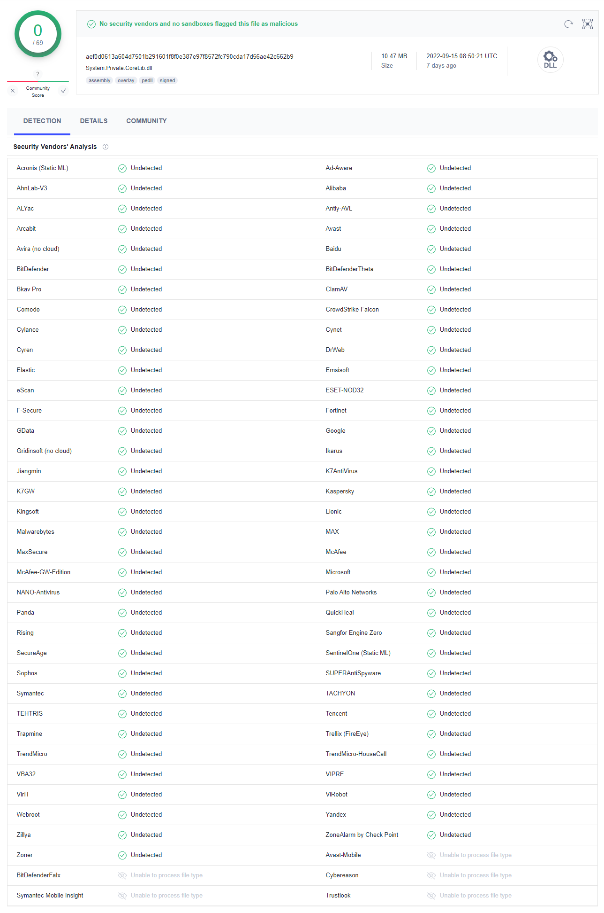

# VirustotalDotnet
一行代码的神奇杀毒软件，纯绿色、集成30多种杀软引擎。

### 1、原理

​	计算出文件指纹（SHA256），提交至VirusTotal进行安全检测。

### 2、关于VirusTotal

​	VirusTotal，是一个提供免费的可疑文件分析服务的网站。2004年6月由创始人Hispasec Sistemas创立。

它与传统杀毒软件的不同之处是它通过多种反病毒引擎扫描文件。使用多种反病毒引擎对您所上传的文件进行检测, 以判断文件是否被病毒, 蠕虫, 木马, 以及各类恶意软件感染。

这样大大减少了杀毒软件误杀或未检出[病毒](https://baike.baidu.com/item/病毒/4811584?fromModule=lemma_inlink)的几率，其检测率优于使用单一产品。其反病毒引擎已经多达40种以上，但是也不能保证该网站扫描通过的文件就彻底无害，毕竟道高一尺，魔高一丈。事实上，没有任何一款软件可以提供100%的病毒和恶意软件检测率，[杀毒软件](https://baike.baidu.com/item/杀毒软件?fromModule=lemma_inlink)所做的就是最大限度的避免用户受到侵害。该网站支持电子邮件或直接上传的两种方式分析文件。

VirusTotal有一款名为VirusTotal Uploader 的外壳扩展，可以帮助方便的上传文件。使用 VirusTotal 不用安装额外的软件，一切都可以操作都是在上网浏览器中完成，所以，VirusTotal的缺点是只能扫描提交的文件，无法对计算机进行全面的检查，并且该网站只支持单个文件的容量在30MB以下的文件上传查毒。此外，VirusTotal每15分钟更新一次病毒资料库，可以实时提供最新的[反病毒](https://baike.baidu.com/item/反病毒/191616?fromModule=lemma_inlink)引擎以检测出大部分可能的威胁。

### 3、编译

1. `git clone https://github.com/nsnail/VirustotalDotnet.git`
2. 运行 `1.build.cmd`，  生成二进制文件在dist目录下

### 4、测试

​	运行 `2.test.cmd` ，将`.\dist\x86\self-contained\System.Private.CoreLib.dll` 提交至VirusTotal并打开浏览器查看文件信息



### 5、使用

1. 从dist目录中挑选合适的版本，copy至你的常用程序目录。

   | 目录                | 说明                                           |
   | ------------------- | ---------------------------------------------- |
   | framework-dependent | .NET框架依赖版本（需安装.net runtime）才能运行 |
   | self-contained      | .NET框架打包版本（无需安装.net runtime)        |
   | single-file         | 单文件绿色版                                   |

2. 运行 `VirustotalDotnet.exe --help` 查看帮助

   ```
   VirustotalDotnet 1.0.0
   Copyright (C) 2022 VirustotalDotnet
   
     -f, --file                          Enter the file path
   
     -i, --install-right-click-menu      Add right-click context menu in Windows
   
     -u, --uninstall-right-click-menu    Remove right-click context menu in Windows
   
     --help                              Display this help screen.
   
     --version                           Display version information.
   
   ```

   | 参数 | 说明                |
   | ---- | ------------------- |
   | -f   | 指定查杀的文件路径  |
   | -i   | 安装windows右键菜单 |
   | -u   | 删除windows右键菜单 |

   
